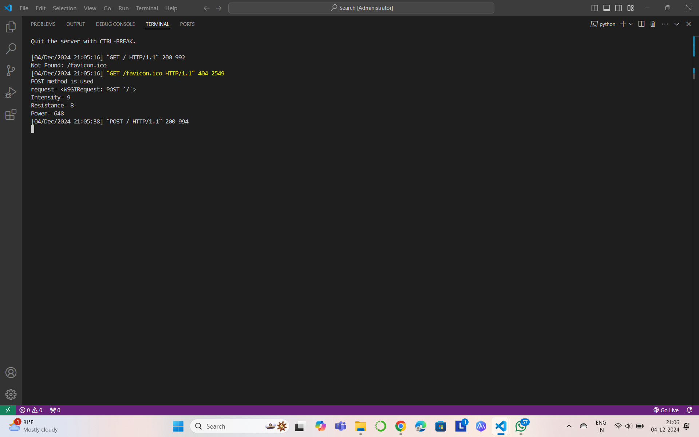

# Ex.05 Design a Website for Server Side Processing
## Date:04/10/2024

## AIM:
 To design a website to calculate the power of a lamp filament in an incandescent bulb in the server side. 


## FORMULA:
P = I<sup>2</sup>R
<br> P --> Power (in watts)
<br> I --> Intensity
<br> R --> Resistance

## DESIGN STEPS:

### Step 1:
Clone the repository from GitHub.

### Step 2:
Create Django Admin project.

### Step 3:
Create a New App under the Django Admin project.

### Step 4:
Create python programs for views and urls to perform server side processing.

### Step 5:
Create a HTML file to implement form based input and output.

### Step 6:
Publish the website in the given URL.

## PROGRAM :
```
math.html

<!DOCTYPE html>
 <html lang="en">
 <head>
    <meta charset="UTF-8">
    <meta name="viewport" content="width=device-width, initial-scale=1.0">
    <title>Document</title>
    <style>
      div{
    font-size: 50px;
    margin-left: 450px;
    margin-top:100px;
    margin-right:350px;
    border:10px dotted black;
    padding:30px;
    background: aqua;
}
    </style>
 </head>
 <body bgcolor="#6EEB83">
    <div>
    <form method="POST">
      
        Intencity :
        <input type="text" name='I'placeholder="enter Intencity" value="{{i}}"></input>
        <br>
        Radius :
        <input type="text" name='R'placeholder="enter radius" value="{{r}}"></input>
        <br>
        <input type="submit"  ></input>
        <br> 
        Answer   
        <input type="text" name='power' placeholder=" Answer" value="{{power}}"></input>

    </form>
    </div>
 </body>
 </html>

urls.py

from django.contrib import admin 
from django.urls import path 
from mathapp import views 
urlpatterns = [ 
    path('admin/', admin.site.urls), 
    path('poweroflamp/',views.powerlamp,name="poweroflamp"),
    path('',views.powerlamp,name="poweroflamproot")
]

views.py

from django.shortcuts import render 
def powerlamp(request): 
    context={} 
    context['power'] = "0" 
    context['i'] = "0" 
    context['r']="0" 
    if request.method == 'POST': 
        print("POST method is used")
        i = request.POST.get('I','0')
        r = request.POST.get('R','0')
        print('request=',request) 
        print('Intensity=',i) 
        print('Resistance=',r) 
        power = (int(i) ** 2)* int(r) 
        context['power'] = power 
        context['i'] = i
        context['r'] = r 
        print('Power=',power) 
    return render(request,'mathapp/math.html',context)
```

## SERVER SIDE PROCESSING:


## HOMEPAGE:


## RESULT:
The program for performing server side processing is completed successfully.
